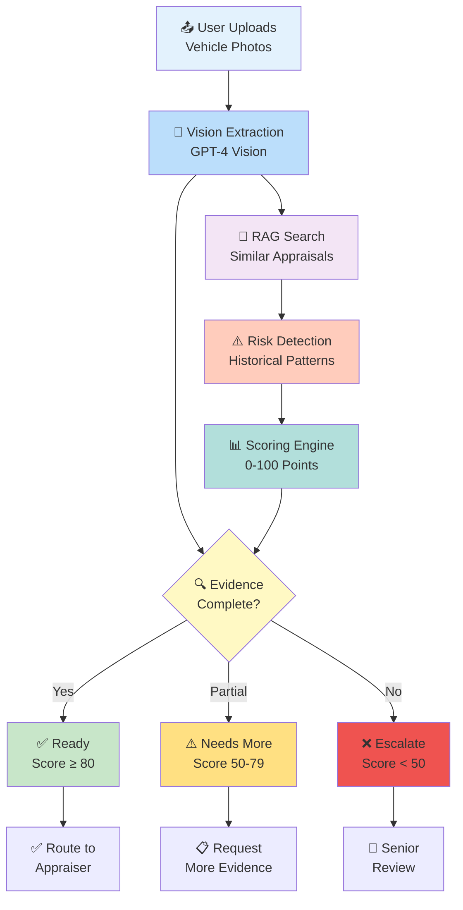
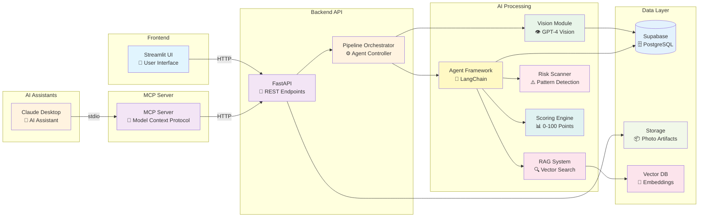
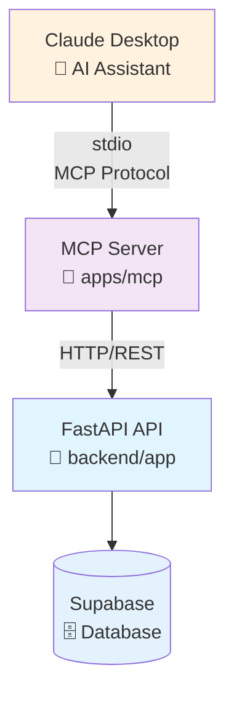
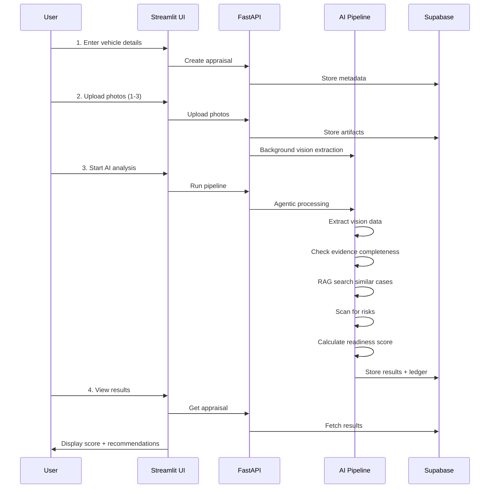

# 🚗 Vehicle Appraisal Pre-Check

> **AI-powered validation system that ensures appraisal evidence is complete before human review begins**

---

## 🎯 What It Does

**Prevents incomplete appraisals from reaching human appraisers** by automatically:

- 📸 **Analyzes photos** to extract vehicle angles, odometer, VIN, and damage
- 🔍 **Checks completeness** against required evidence standards
- ⚠️ **Detects risks** using historical context from similar appraisals
- 📊 **Calculates readiness score** (0-100) to route decisions confidently
- 📝 **Maintains audit trail** of every AI decision for transparency

---

## 🔄 How It Works



---

## 🏗️ Architecture



---

## 🤖 MCP Integration (Model Context Protocol)

**Enable AI assistants like Claude Desktop to query appraisal data directly**

The MCP server exposes read-only tools that allow AI assistants to interact with the appraisal system, making it easy to check status, evidence completeness, risk flags, and audit logs through natural language.

### Architecture



### Available MCP Tools

| Tool | Description |
|------|-------------|
| `get_appraisal_status` | Get status, readiness score, and decision |
| `check_evidence_completeness` | Check missing evidence and photo angles |
| `get_risk_flags` | Get all risk flags by severity |
| `get_decision_readiness` | Get readiness assessment with score breakdown |
| `get_ledger_events` | Get complete audit ledger (event log) |

### Quick Setup

**1. Start MCP Server (with Docker)**
```bash
# Start all services including MCP
docker-compose --profile mcp up -d

# Or run MCP server locally
cd apps/mcp
pip install -r requirements.txt
export API_BASE_URL=http://localhost:8001
python server.py
```

**2. Connect Claude Desktop**

Edit Claude Desktop config (`~/Library/Application Support/Claude/claude_desktop_config.json` on Mac):

```json
{
  "mcpServers": {
    "vehicle-appraisal": {
      "command": "docker",
      "args": [
        "run",
        "--rm",
        "-i",
        "--network=vehicle-appraisal-app_appraisal-network",
        "-e",
        "API_BASE_URL=http://api:8000",
        "vehicle-appraisal-app-mcp:latest",
        "python",
        "server.py"
      ]
    }
  }
}
```

**3. Restart Claude Desktop** - MCP tools will be available automatically!

### Example Usage

Once connected, you can ask Claude Desktop:
- *"What's the status of appraisal QE43?"*
- *"Check if appraisal ABC1 has complete evidence"*
- *"Show me risk flags for appraisal XYZ9"*
- *"Get the readiness score breakdown for appraisal DEF2"*

See [`apps/mcp/README.md`](apps/mcp/README.md) for detailed documentation.

---

## ✨ Key Features

### 🎯 **Smart Evidence Validation**
```
Required Evidence:
├── 📸 Photo Coverage (48 pts)
│   ├── Front view
│   ├── Rear view
│   ├── Left side
│   ├── Right side
│   ├── Interior
│   └── Odometer reading
├── ⏲️ Odometer Confidence (15 pts)
├── 🔑 VIN Detection (10 pts)
└── 📝 Notes Quality (20 pts)
```

### 🤖 **Agentic Processing**
- **Adaptive workflow**: AI agent decides which tools to use and when
- **Self-correcting**: Automatically retries failed steps
- **Context-aware**: Uses RAG to find similar historical cases
- **Transparent**: Every decision logged in immutable ledger

### 📊 **Decision Routing**
```
Score ≥ 80  → ✅ Ready to Decide
Score 50-79 → ⚠️ Needs More Evidence
Score < 50  → 🔴 Escalation Required
```

### 🔍 **RAG-Enhanced Analysis**
- Searches historical appraisals for similar patterns
- Identifies risks based on past outcomes
- Provides context for confidence scoring

---

## 🚀 Quick Start

### Prerequisites
- Python 3.11+
- Supabase account (database + storage)
- OpenAI API key
- Docker (optional, for local dev)

### 1️⃣ Setup Environment

   ```bash
# Clone repository
   git clone <repository-url>
   cd vehicle-appraisal-app
   
# Backend environment
   cp backend/.env.example backend/.env
# Edit backend/.env with your credentials

# Frontend environment
   cp frontend/.env.example frontend/.env
# Edit frontend/.env with API URL
```

### 2️⃣ Database Setup

Run migrations in Supabase SQL Editor (in order):
1. `migrations/001_core.sql` - Core schema
2. `migrations/002_rag_embeddings.sql` - Vector search
3. `migrations/003_short_ids.sql` - Short IDs

Create storage bucket: `appraisal-artifacts`

### 3️⃣ Run Locally

**Option A: Docker (Recommended)**
   ```bash
# Start API and UI
   docker-compose up

# Or include MCP server for AI assistant integration
docker-compose --profile mcp up
```
- API: http://localhost:8001
- UI: http://localhost:8502
- MCP: Available via stdio (for Claude Desktop)

**Option B: Manual**
   ```bash
# Backend
   cd backend
   pip install -r requirements.txt
   uvicorn app.main:app --reload
   
# Frontend (new terminal)
   cd frontend
   pip install -r requirements.txt
   streamlit run app.py
   ```

---

## 📋 User Workflow



---

## 🛠️ Technology Stack

| Layer | Technology | Purpose |
|-------|-----------|---------|
| **Frontend** | Streamlit | User interface |
| **Backend** | FastAPI | REST API |
| **Database** | Supabase (PostgreSQL) | Data storage |
| **Storage** | Supabase Storage | Photo artifacts |
| **Vector DB** | pgvector | Embedding search |
| **AI Vision** | GPT-4 Vision | Photo analysis |
| **AI Text** | GPT-4o-mini | Agent reasoning |
| **Agent** | LangChain | Orchestration |
| **MCP** | Model Context Protocol | AI assistant integration |
| **Deployment** | Render.com | Hosting |

---

## 📊 Scoring Breakdown

```
Total Score: 100 points

┌─────────────────────────┬───────┬────────────────────┐
│ Category                │ Points│ Description        │
├─────────────────────────┼───────┼────────────────────┤
│ 📸 Photo Coverage       │  48   │ 6 angles × 8 pts  │
│ ⏲️ Odometer Confidence  │  15   │ Reading quality   │
│ 🔑 VIN Presence         │  10   │ Optional bonus    │
│ 📝 Notes Consistency    │  20   │ Quality check     │
│ ⚠️ Risk Penalties       │  -7   │ Deductions        │
└─────────────────────────┴───────┴────────────────────┘
```

---

## 🔐 Environment Variables

### Backend (`backend/.env`)
```bash
SUPABASE_URL=https://xxx.supabase.co
SUPABASE_SERVICE_ROLE_KEY=xxx
SUPABASE_STORAGE_BUCKET=appraisal-artifacts
OPENAI_API_KEY=sk-xxx
ENABLE_RAG=true
```

### Frontend (`frontend/.env`)
```bash
API_BASE_URL=http://localhost:8000
API_TIMEOUT_SECONDS=60
```

---

## 📡 API Endpoints

| Method | Endpoint | Description |
|--------|----------|-------------|
| `POST` | `/api/appraisals` | Create appraisal with photos |
| `POST` | `/api/appraisals/create` | Create appraisal (no photos) |
| `POST` | `/api/appraisals/{id}/photos/upload` | Upload single photo |
| `POST` | `/api/appraisals/{id}/run` | Start AI analysis |
| `GET` | `/api/appraisals/{id}` | Get appraisal results |
| `GET` | `/api/appraisals/{id}/photos` | Get all photos |
| `GET` | `/api/appraisals/{id}/ledger` | Get audit trail |
| `GET` | `/healthz` | Health check |
| `GET` | `/readyz` | Readiness check |

---

## 🚢 Deployment

### Render.com (Free Tier Compatible)

1. **Connect GitHub** repository to Render
2. **Create Blueprint** using `render.yaml`
3. **Set environment variables** in Render dashboard
4. **Deploy** - Both services auto-deploy

**Note**: Free tier services spin down after 15 min inactivity. First request may take 30-60s (cold start).

---

## 📈 Performance

- **Vision extraction**: ~10-15s per photo (background)
- **Full pipeline**: ~2 minutes (agentic mode)
- **Concurrent uploads**: Up to 3 photos in parallel
- **RAG search**: <500ms (with pgvector HNSW index)

---

## 🔍 Monitoring & Debugging

### Health Checks
```bash
# Liveness
curl http://localhost:8000/healthz

# Readiness (checks Supabase, OpenAI, RAG)
curl http://localhost:8000/readyz
```

### View Audit Ledger
Every decision is logged in the immutable ledger:
- Navigate to "View Appraisal" → "Event Log" tab
- Download JSON for full audit trail

---

## 🧪 Testing

See `TESTING_PLAN.md` for comprehensive testing strategy.

---

## 📚 Project Structure

```
vehicle-appraisal-app/
├── backend/              # FastAPI backend
│   ├── app/
│   │   ├── main.py      # API endpoints
│   │   ├── pipeline.py   # Agent orchestrator
│   │   ├── vision.py     # Photo analysis
│   │   ├── risk.py       # Risk detection
│   │   └── scoring.py    # Readiness scoring
│   └── requirements.txt
├── frontend/            # Streamlit UI
│   ├── app.py           # Main app
│   └── components/      # UI components
├── apps/
│   └── mcp/             # MCP server
│       ├── server.py    # MCP server implementation
│       └── tools/       # MCP tools
├── shared/              # Shared packages
│   ├── agent/           # LangChain agent
│   ├── rag/             # RAG functionality
│   └── ledger/           # Audit ledger
├── migrations/          # Database migrations
├── docker-compose.yml    # Local development
└── render.yaml          # Render deployment
```

---

## 🤝 Contributing

1. Fork the repository
2. Create feature branch (`git checkout -b feature/amazing-feature`)
3. Commit changes (`git commit -m 'Add amazing feature'`)
4. Push to branch (`git push origin feature/amazing-feature`)
5. Open Pull Request

---

## 📄 License

[Your License Here]

---

## 🆘 Support

For issues and questions:
- Open a GitHub issue
- Check `SETUP.md` for detailed setup instructions
- Review `PROGRESS.md` for build status

---

<div align="center">

**Built with ❤️ using FastAPI, Streamlit, LangChain, and OpenAI**

[🚀 Get Started](#-quick-start) • [📖 Documentation](SETUP.md) • [🐛 Report Issue](https://github.com/your-repo/issues)

</div>
